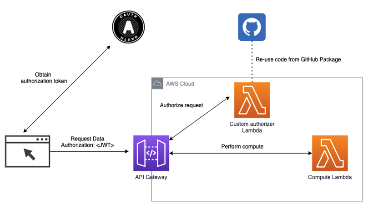

## Open Auth example
An example usage of the shared authoriser function defined here https://github.com/changamire/open-authoriser

The project consists of 2 components

#### Backend
The backend creates a simple API consisting of an API GW
with a Lambda based custom authoriser using the shared open authoriser 
function, and exposing a Lambda with an Express based API
with a single method to calculate PI based on the Monte Carlo
method.

#### Frontend
A simple React app, protected by Cognito, and calling the backend API.

To run the frontend application
 - Update the file `config.js` with the appropriate settings from your backend
 - Run `npm install'
 - Run `npm run start`
 - Navigate to http://localhost:8080

The architecture is shown in the figure below

